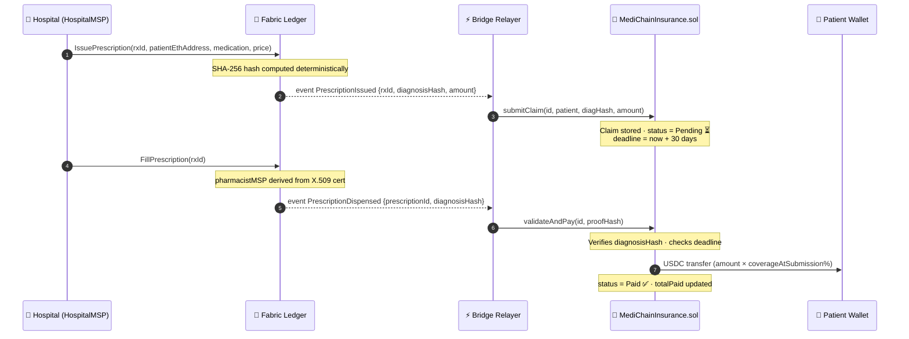
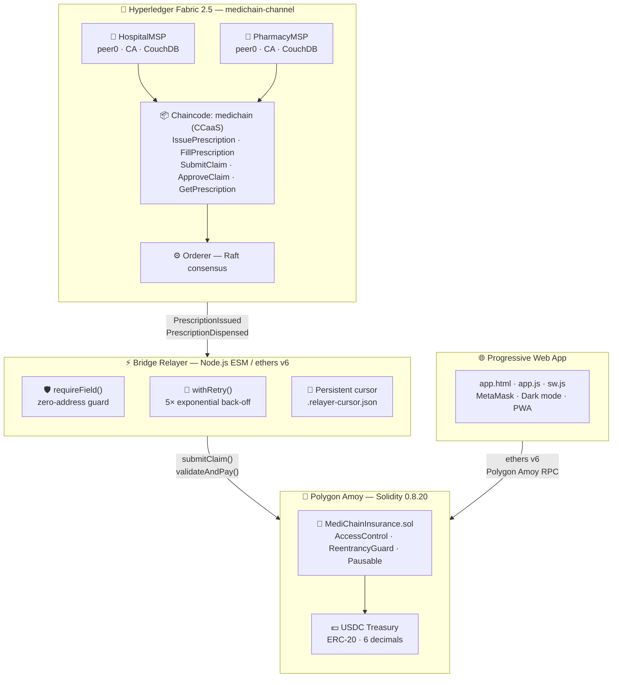
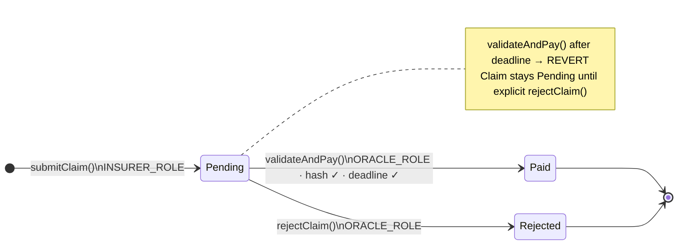
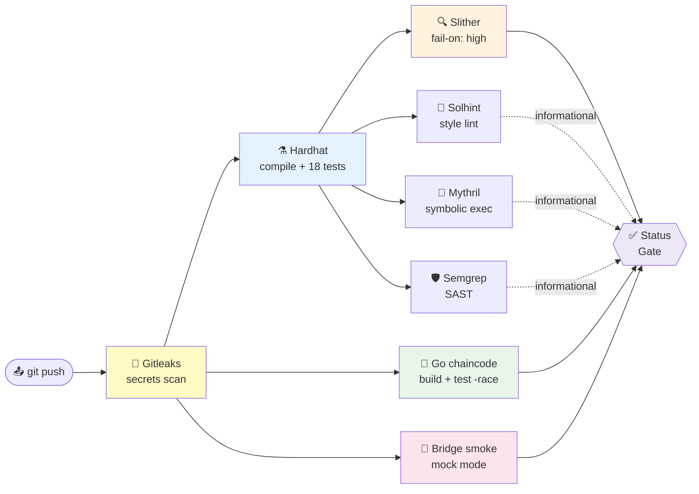

<div align="center">


# MediChain+

### Parametric Micro-Insurance for Pharmaceutical Prescriptions

> Instant USDC disbursement the moment a prescription is dispensed on a Hyperledger Fabric private ledger —  
> no manual adjudication, no paperwork, no delays.

<br/>

[](https://github.com/omarbabba779xx/Medichain-plus/actions/workflows/ci.yml)
[](contracts/MediChainInsurance.sol)
[](fabric-network/)
[](https://amoy.polygonscan.com)
[](contracts/)
[](chaincode/)
[](bridge/)
[](LICENSE)

<br/>

</div>

---

## Overview

MediChain+ bridges two blockchain paradigms to deliver **parametric insurance** in healthcare:

- A **Hyperledger Fabric 2.5** private network manages the full prescription lifecycle between hospitals (`HospitalMSP`) and pharmacies (`PharmacyMSP`) — keeping sensitive patient data off any public chain.
- A **Solidity smart contract** on **Polygon Amoy** holds a USDC treasury and automatically disburses funds the instant a dispensation event is relayed and validated.
- A **Node.js event bridge** translates Fabric chaincode events into Ethereum transactions in real time, with retry logic, persistent cursor, and zero-address protection.

No intermediary. No manual claim review. The code is the insurer.

---

## Key Features

| Feature | Detail |
|---|---|
| **Parametric payout** | USDC transferred automatically on `PrescriptionDispensed` event — no human approval |
| **85 % coverage** | Configurable per-claim coverage snapshot, immune to post-submission admin changes |
| **30-day claim expiry** | Deadline enforced on-chain at submission time (`block.timestamp + claimExpiryDays`) |
| **Role separation** | `ORACLE_ROLE ≠ INSURER_ROLE ≠ DEFAULT_ADMIN_ROLE` — enforced in constructor |
| **Privacy by design** | Only opaque UUIDs and `keccak256` hashes on-chain — no PHI ever written to a ledger |
| **MSP-enforced access** | Fabric chaincode rejects callers outside `HospitalMSP` / `PharmacyMSP` at cert level |
| **Reentrancy-safe** | `nonReentrant` on every state-mutating USDC transfer, checks-effects-interactions pattern |
| **Emergency controls** | `pause()` / `unpause()` + `emergencyWithdraw()` with bounds check and event log |
| **Full CI pipeline** | Gitleaks · Hardhat · Slither · Go test -race · Solhint · Mythril · Semgrep |
| **HDS / GDPR ready** | DPIA, EBIOS-RM, RGPD register, SLA, PCA/PRA, RACI documentation included |

---

## How It Works

A prescription is issued by a hospital doctor on the **Fabric private ledger**. The moment a pharmacy fills it, the bridge relayer picks up the `PrescriptionDispensed` event and calls `validateAndPay()` on Polygon — the patient receives USDC within seconds.



---

## System Architecture



---

## Smart Contract Reference

### `MediChainInsurance.sol` — Key Parameters

| Parameter | Default | Admin setter |
|---|---|---|
| `coveragePercent` | 85% | `setCoverage(uint256)` |
| `maxClaimAmount` | 5,000 USDC | `setMaxClaimAmount(uint256)` |
| `claimExpiryDays` | 30 days | `setClaimExpiryDays(uint256)` |

### Role Matrix

| Role | Holder | Permitted actions |
|---|---|---|
| `DEFAULT_ADMIN_ROLE` | Deployer multisig | `setCoverage` · `setMaxClaimAmount` · `setClaimExpiryDays` · `pause` · `unpause` · `emergencyWithdraw` |
| `INSURER_ROLE` | Bridge relayer | `submitClaim` |
| `ORACLE_ROLE` | Bridge relayer (separate key) | `validateAndPay` · `rejectClaim` |

> **Constructor invariant:** `oracle ≠ insurer ≠ admin` — any overlap reverts deployment.

### Claim State Machine



### Claim Struct

```solidity
struct Claim {
    address patient;
    bytes32 diagnosisHash;        // sha256(rxId + patientId + medication)
    uint256 amount;               // USDC with 6 decimals
    uint256 timestamp;            // block.timestamp at submitClaim
    uint256 deadline;             // timestamp + claimExpiryDays * 1 days
    uint256 coverageAtSubmission; // snapshot — immune to setCoverage() after submission
    Status  status;               // None | Pending | Paid | Rejected
}
```

---

## Chaincode Reference

### `medichain` (Go 1.21 · CCaaS mode)

| Function | Caller MSP | Description |
|---|---|---|
| `IssuePrescription(id, patientId, patientEthAddress, doctorId, medication, dosage, price)` | `HospitalMSP` | Creates prescription, computes SHA-256 hash, emits `PrescriptionIssued` |
| `FillPrescription(id)` | `PharmacyMSP` | Marks prescription as filled, derives `pharmacistMSP` from X.509 cert, emits `PrescriptionDispensed` |
| `SubmitClaim(claimId, prescriptionId, patientId, amount)` | `PharmacyMSP` | Records insurance claim on Fabric ledger |
| `ApproveClaim(claimId)` | `HospitalMSP` or `PharmacyMSP` | Approves a pending claim on Fabric |
| `GetPrescription(id)` | Any MSP | Read-only prescription lookup |
| `GetClaim(claimId)` | Any MSP | Read-only claim lookup |

> **Security:** `pharmacistMSP` is derived from the caller's X.509 certificate — never accepted as a user-supplied parameter.

---

## Bridge Relayer

The `bridge/relayer.js` script runs as a Node.js ESM process that listens to Fabric chaincode events and calls `MediChainInsurance.sol` on Polygon Amoy.

**Reliability features:**

| Feature | Implementation |
|---|---|
| Zero-address guard | `requireField()` — throws on empty/zero values before any chain call |
| Retry logic | `withRetry()` — 5 attempts with exponential back-off on Polygon RPC failures |
| Persistent cursor | Writes last processed Fabric block to `.relayer-cursor.json` — survives restarts |
| Fallback address | `BRIDGE_DEFAULT_PATIENT_ADDRESS` for events that omit `patientAddress` |
| Mock mode | `--mode=mock --once` — full pipeline test without any live blockchain |

---

## Security Audit

All **19 findings** from the internal security audit have been fully remediated.

| ID | Finding | Severity | Status |
|---|---|---|---|
| C-01 | Oracle/insurer role overlap possible in constructor | Critical | ✅ Fixed |
| C-02 | `emergencyWithdraw` missing reentrancy guard + bounds check | Critical | ✅ Fixed |
| C-03 | MSP access control absent in Go chaincode | Critical | ✅ Fixed |
| C-04 | `time.Now()` non-determinism across Fabric peers | Critical | ✅ Fixed |
| C-05 | `float64` monetary amounts causing consensus non-determinism | Critical | ✅ Fixed |
| C-06 | Bridge relayer silent fallback to zero-address | Critical | ✅ Fixed |
| H-01 | Claim expiry not enforced in `validateAndPay` | High | ✅ Fixed |
| H-02 | Coverage % changeable after claim submission | High | ✅ Fixed |
| H-03 | No retry logic on Polygon RPC failures | High | ✅ Fixed |
| H-04 | No persistent Fabric block cursor — events lost on restart | High | ✅ Fixed |
| H-05 | `setMaxClaimAmount(0)` would block all future claims | High | ✅ Fixed |
| H-06 | `emergencyWithdraw` path untested | High | ✅ Fixed |
| H-07 | Slither `continue-on-error` silencing High-severity findings | High | ✅ Fixed |
| M-01 | MSP constant mismatch (`Org1MSP` vs `HospitalMSP`) in chaincode | Medium | ✅ Fixed |
| M-02 | `rejectClaim` path untested | Medium | ✅ Fixed |
| M-03 | Gitleaks secrets scanning absent from CI | Medium | ✅ Fixed |
| M-04 | GDPR Art. 35 DPIA missing | Medium | ✅ Fixed |
| L-01 | `deployment.json` with contract addresses not in `.gitignore` | Low | ✅ Fixed |
| L-02 | CouchDB admin credentials hardcoded in `docker-compose.yaml` | Low | ✅ Fixed |
| L-03 | Missing `receive`/`fallback` revert — native token lockup risk | Low | ✅ Fixed |

---

## CI/CD Pipeline

Every push triggers an 8-job pipeline. Only **5 jobs block merge** — analytical tools are informational.



| Job | Tool | Blocks merge | Notes |
|---|---|---|---|
| Secrets scan | Gitleaks CLI 8.x | ✅ Yes | Scans full git history |
| Solidity | Hardhat 2.22 | ✅ Yes | 18 unit + security tests |
| Static analysis | Slither `fail-on: high` | ✅ Yes | Excludes test + vendor |
| Go chaincode | `go test -race` | ✅ Yes | Races condition detection |
| Bridge smoke | `relayer.js --mode=mock` | ✅ Yes | Full pipeline, no live nodes |
| Style lint | Solhint 5.x | No | Informational |
| Symbolic exec | Mythril | No | Informational |
| SAST | Semgrep | No | Informational |

---

## Technology Stack

| Layer | Technology | Purpose |
|---|---|---|
| Private ledger | Hyperledger Fabric 2.5 · Go 1.21 | Prescription lifecycle, MSP-based access control |
| Smart contract | Solidity 0.8.20 · OpenZeppelin v4.9 | USDC treasury, parametric payout, role-based access |
| DeFi integration | Polygon Amoy · USDC ERC-20 | Public chain for transparent, auditable payouts |
| Event bridge | Node.js ESM · ethers v6 | Real-time Fabric→Polygon event relay |
| Frontend | HTML5 PWA · Service Worker | Demo interface with MetaMask integration |
| Infrastructure | Docker Compose · Raft orderer · CouchDB | Local development network |
| Testing | Hardhat · go test · Chai · Mocha | Contract + chaincode unit and integration tests |
| Security tooling | Slither · Mythril · Semgrep · Solhint · Gitleaks | Multi-layer static and symbolic analysis |

---

## Repository Structure

```
Medichain-plus/
├── contracts/
│   ├── MediChainInsurance.sol     # Core insurance contract — USDC treasury + payout
│   └── MockERC20.sol              # Test-only mock stablecoin (USDC simulation)
├── chaincode/
│   ├── medichain/
│   │   ├── medichain.go           # Fabric chaincode — prescription + claim lifecycle
│   │   ├── Dockerfile             # Multi-stage Go build for CCaaS deployment
│   │   └── go.mod
│   ├── medical_records.go         # Fabric chaincode — records, consent, ECDSA sig verification
│   ├── medical_records_test.go    # Go unit tests
│   └── go.mod
├── bridge/
│   ├── relayer.js                 # Node.js event bridge — Fabric → Polygon Amoy
│   ├── package.json
│   └── fixtures/
│       └── events.jsonl           # Mock Fabric events for CI and local dev
├── fabric-network/
│   ├── docker-compose.yaml        # 2-org network (HospitalMSP + PharmacyMSP)
│   ├── configtx.yaml              # Channel + orderer configuration
│   ├── crypto-config.yaml         # MSP certificate topology
│   ├── channel-artifacts/         # Pre-generated genesis block
│   └── scripts/
│       ├── deploy-ccaas.sh        # One-shot network + chaincode deployment
│       ├── run-e2e.sh             # End-to-end integration test script
│       └── start-network.sh       # Network startup helper
├── test/
│   ├── MediChainInsurance.test.js # 18 Hardhat tests — unit + security scenarios
│   └── e2e/
│       └── full-flow.mjs          # Full business flow E2E test
├── scripts/
│   └── deploy.js                  # Hardhat deployment script (Amoy + localhost)
├── docs/
│   ├── DPIA.md                    # GDPR Art. 35 Data Protection Impact Assessment
│   └── HDS/
│       ├── ebios-rm.md            # EBIOS Risk Manager threat analysis
│       ├── rgpd-register.md       # GDPR processing register
│       ├── sla.md                 # Service Level Agreement
│       ├── pca-pra.md             # Business continuity + disaster recovery
│       ├── raci-matrix.md         # Responsibility assignment matrix
│       └── criteria-checklist.md  # HDS certification checklist
├── .github/workflows/ci.yml       # 8-job CI pipeline
├── app.html / app.js / app.css    # Progressive Web App frontend
├── index.html                     # Project landing page
├── sw.js                          # Service worker (PWA offline support)
├── hardhat.config.js              # Hardhat — Amoy + localhost network config
├── slither.config.json            # Slither static analysis configuration
└── .semgrep.yml                   # Semgrep SAST rules
```

---

## Prerequisites

| Tool | Min. Version | Purpose |
|---|---|---|
| Node.js + npm | 20 LTS | Hardhat, tests, bridge relayer |
| Go | 1.21 | Chaincode compilation and tests |
| Docker + Docker Compose | 24+ | Fabric network |
| Hyperledger Fabric binaries | 2.5.6 | `cryptogen`, `configtxgen`, `peer` |

---

## Quick Start

### 1 — Clone & install

```bash
git clone https://github.com/omarbabba779xx/Medichain-plus.git
cd Medichain-plus
npm install
cd bridge && npm install && cd ..
```

### 2 — Run the Solidity test suite

```bash
npx hardhat test              # 18 tests — should all pass
npx hardhat coverage          # HTML report → coverage/index.html
```

### 3 — Run the bridge in mock mode (no blockchain needed)

```bash
node bridge/relayer.js --mode=mock --once
```

### 4 — Deploy the Fabric network (WSL2 / Linux)

```bash
bash fabric-network/scripts/deploy-ccaas.sh
```

The script bootstraps the entire 2-org network, creates `medichain-channel`, builds and deploys the CCaaS chaincode image, and runs a smoke test.

### 5 — Deploy to Polygon Amoy

```bash
cp .env.example .env
# Fill in PRIVATE_KEY and AMOY_RPC
npx hardhat run scripts/deploy.js --network amoy
```

Contract addresses are saved to `deployment.json` (git-ignored).

### 6 — Start the bridge relayer (production)

```bash
export FABRIC_CONN_PROFILE=/path/to/connection-profile.json
export WALLET_PATH=/path/to/wallet
export PRIVATE_KEY=0x...
export CONTRACT_ADDRESS=0x...
node bridge/relayer.js --mode=real
```

The relayer persists its position in `.relayer-cursor.json` — safe to restart at any time with no missed events.

---

## Environment Variables

### Bridge Relayer (`bridge/relayer.js`)

| Variable | Required | Default | Description |
|---|---|---|---|
| `RELAYER_MODE` | No | `mock` | `real` \| `mock` |
| `AMOY_RPC` | real only | Polygon public RPC | Polygon Amoy JSON-RPC endpoint |
| `PRIVATE_KEY` | real only | — | Oracle wallet private key (0x-prefixed hex) |
| `CONTRACT_ADDRESS` | real only | — | Deployed `MediChainInsurance` address |
| `FABRIC_CONN_PROFILE` | real only | — | Path to Fabric connection-profile JSON |
| `WALLET_PATH` | real only | — | Path to Fabric file-system wallet |
| `USER_ID` | No | `admin` | Fabric identity name in wallet |
| `FABRIC_CHANNEL` | No | `medichain-channel` | Fabric channel name |
| `CHAINCODE_NAME` | No | `medichain` | Chaincode name |
| `CURSOR_FILE` | No | `bridge/.relayer-cursor.json` | Block cursor persistence path |
| `BRIDGE_DEFAULT_PATIENT_ADDRESS` | No | — | Fallback ETH address when Fabric event omits `patientAddress` |

### Fabric Network

| Variable | Default | Description |
|---|---|---|
| `COUCHDB_PASSWORD` | `adminpw` | CouchDB admin password — **always override in production** |

---

## Compliance & Data Privacy

MediChain+ is designed from the ground up for healthcare regulatory compliance.

```
┌─────────────────────────────────┐    ┌──────────────────────────────────────┐
│   ON-CHAIN (Fabric + Polygon)   │    │   OFF-CHAIN (HDS infrastructure)     │
│                                 │    │                                      │
│  • Opaque patient UUID          │    │  • Patient name / DOB / address      │
│  • keccak256(diagnosisHash)     │◄───│  • Full prescription text            │
│  • USDC claim amount            │    │  • Medical images / reports          │
│  • Claim status + timestamps    │    │  • Doctor / pharmacy details         │
│                                 │    │                                      │
│  ✅ No PHI ever written on-chain │    │  🔒 HDS-certified storage required   │
└─────────────────────────────────┘    └──────────────────────────────────────┘
```

| Requirement | Document | Status |
|---|---|---|
| GDPR Art. 35 — DPIA | `docs/DPIA.md` | ✅ Complete |
| EBIOS Risk Manager analysis | `docs/HDS/ebios-rm.md` | ✅ Complete |
| GDPR processing register | `docs/HDS/rgpd-register.md` | ✅ Complete |
| SLA definition | `docs/HDS/sla.md` | ✅ Complete |
| PCA / PRA (BCP / DR) | `docs/HDS/pca-pra.md` | ✅ Complete |
| RACI responsibility matrix | `docs/HDS/raci-matrix.md` | ✅ Complete |
| HDS certification checklist | `docs/HDS/criteria-checklist.md` | ✅ Complete |
| PHI never written on-chain | Enforced by architecture | ✅ |
| HDS-certified infrastructure | Required before production go-live | ⏳ |
| DPO appointment | Required before production go-live | ⏳ |

> **Production note:** Polygon mainnet deployment requires a Data Processing Agreement with Polygon Labs and legal review of cross-border data flows under GDPR Chapter V.

---

## Contributing

1. Fork the repository and create a feature branch: `git checkout -b feat/your-feature`
2. Write or update tests **before** implementing changes
3. Ensure the full test suite passes: `npx hardhat test`
4. Ensure Slither reports no high-severity findings: `npx slither contracts/`
5. Open a pull request — the CI pipeline must be **fully green** before review

**Code standards:**

| Layer | Standards |
|---|---|
| Solidity | No `pragma experimental`; follow `.solhint.json`; checks-effects-interactions on all transfers |
| Go chaincode | `uint64` for all monetary values; use `ctx.GetStub().GetTxTimestamp()` — never `time.Now()` |
| Bridge | ESM modules; validate all event fields via `requireField()`; wrap all RPC calls in `withRetry()` |
| Tests | Every new contract function must have Hardhat coverage; new chaincode functions must have Go tests |

---

## License

MIT — see [LICENSE](LICENSE)

---

<div align="center">

**MediChain+** — Where healthcare meets trustless automation.

Built on [Hyperledger Fabric](https://www.hyperledger.org/use/fabric) &nbsp;·&nbsp;
[Polygon](https://polygon.technology/) &nbsp;·&nbsp;
[OpenZeppelin](https://openzeppelin.com/) &nbsp;·&nbsp;
[ethers.js](https://docs.ethers.org/)

<br/>

*Parametric insurance · Zero manual adjudication · HDS/GDPR compliant*

</div>
